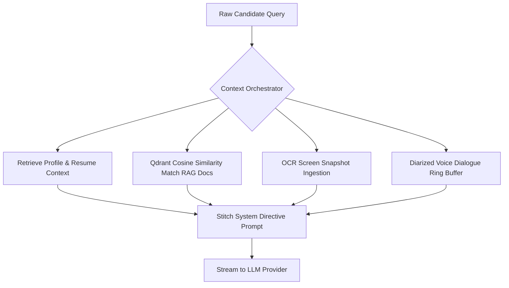

# Systems Architecture & Subagent Instructions: BackDoor AI

Welcome, Agent. You are pair programming on **BackDoor AI**, a standalone, privacy-first local Windows desktop AI interview co-pilot and preparation assistant. 

This document defines the strict engineering standards, architectural invariants, and code hygiene rules established by a 15+ years veteran software architect. Adhering to these guidelines is non-negotiable.

---

## 1. Core Architectural Invariants

### 1.1 Technology Stack Boundaries
1. **Frontend Layer**: React 18 + TypeScript + Vite + Tailwind CSS + Zustand (State Management).
2. **Backend Core Layer**: Native Rust (compiled inside the Tauri container). **NO external runtime sidecars** (e.g., Node, Java, Python, or Go binaries) except for the vector database.
3. **Database Layer (Relational)**: SQLite 3 using the `rusqlite` crate with the `bundled` feature.
4. **Vector Database Layer (Semantic RAG)**: Local Qdrant binary sidecar (`qdrant.exe`).
5. **IPC Mechanism**: Communication between Frontend and Backend is exclusively via Tauri Commands (`#[tauri::command]`) and Tauri Events (`app_handle.emit`). **NO local HTTP REST or WebSocket servers** for frontend-to-backend IPC.

### 1.2 Resource & Port Management
*   **Dynamic Ports Only**: The Qdrant sidecar **MUST** bind to a dynamic free port selected at runtime via `port_picker.rs` to avoid port collisions with other applications.
*   **Orphan Process Prevention**: Background sidecars (e.g., Qdrant) **MUST** be bound to a Windows Job Object (`JOBOBJECT_EXTENDED_LIMIT_INFORMATION` with `JOB_OBJECT_LIMIT_KILL_ON_JOB_CLOSE`) to ensure they terminate immediately when the main Rust process closes or panics.

### 1.3 Key Security Invariants
*   **DPAPI Key Protection**: API keys (Gemini, Groq, Anthropic, OpenAI) **MUST NEVER** be stored in:
    *   Plaintext configurations or local files.
    *   `localStorage` or frontend memory states permanently.
    *   Unencrypted SQLite columns.
*   **Windows Credential Manager**: Always use the Windows Credential Manager via the Rust `keyring` crate under the service name `BackDoorAI` for secure DPAPI-backed key storage.

### 1.4 Windows Capture Exclusion (Stealth HUD)
*   **Exclusion from Capture**: The overlay window **MUST** apply `SetWindowDisplayAffinity(hwnd, WDA_EXCLUDEFROMCAPTURE)` at the Win32 API level. This prevents screen-capture and screen-sharing tools (Zoom, Microsoft Teams, Google Meet, Discord, Snipping Tool) from seeing the co-pilot HUD overlay.

---

## 2. Directory Structure & Responsibilities

The workspace is organized into peer directories to separate concerns:

```
BackDoor-AI/
├── backdoor-ai-be/             # 🦀 Native Rust Backend Core Project
│   ├── src/                    # Rust source code (audio, OCR, db, key management)
│   ├── Cargo.toml              # Rust crate manifest & dependencies
│   ├── tauri.conf.json         # Tauri app manifest & window layout
│   └── package.json            # Helper NPM scripts for running Tauri from the backend
│
├── backdoor-ai-ui/             # ⚛️ React 18 + TypeScript Frontend Project
│   ├── src/                    # React components, Zustand stores, layout views
│   ├── package.json            # Frontend dependency definitions & build scripts
│   └── vite.config.ts          # Bundler & Dev-server configurations
│
├── tools/                      # Sidecar executables (qdrant.exe)
└── README.md                   # Technical documentation
```

---

## 3. Rust Code Hygiene & Best Practices

All Rust code written for the backend **MUST** follow strict systems programming practices:

### 3.1 Error Handling & Unwraps
*   **No Panics in Commands**: Commands exposed to the frontend (`#[tauri::command]`) **MUST** return a `Result<T, E>` where `E` is a serialized error (e.g., `String` or a custom enum serializing via `serde`). **NEVER** use `.unwrap()` or `.expect()` inside commands.
*   **Custom Errors**: Use the `thiserror` crate to define descriptive custom error enums. Example:
    ```rust
    #[derive(thiserror::Error, Debug)]
    pub enum AppError {
        #[error("Database error: {0}")]
        Database(#[from] rusqlite::Error),
        #[error("Keyring error: {0}")]
        Keyring(#[from] keyring::Error),
        #[error("Generic failure: {0}")]
        Generic(String),
    }
    ```

### 3.2 Threading & Safe Concurrency
*   **Thread-Safe SQLite**: SQLite connections **MUST** be thread-safe. Use `Arc<Mutex<rusqlite::Connection>>` or a connection pool when sharing the database reference across Tauri command threads.
*   **Async Task Spawning**: Use `tauri::async_runtime::spawn` or `tokio::spawn` for long-running processes (like audio loopback capture or screen OCR polling) to prevent blocking the main OS thread or GUI event loop.

### 3.3 Resource Management (RAII)
*   **Deterministic Cleanup**: Use the RAII pattern via the `Drop` trait to release system handles, close files, or mute CPAL WASAPI streams cleanly when structs fall out of scope.
*   **Memory Allocations**: Avoid excessive cloning in high-frequency loops (such as audio DSP processing). Reuse buffers (`Vec::clear` and `Vec::shrink_to_fit` where appropriate).

### 3.4 Token Efficiency & File Exclusions (Agent Guideline)
*   **Context Optimization**: To prevent context window overflow and token exhaustion, **NEVER** scan, read, or output files from:
    - Build artifact directories: `**/target/`, `**/dist/`, `**/build/`, `**/out/`
    - Node dependency directories: `**/node_modules/`
    - Local storage, sidecar data, and DB binaries: `**/qdrant_data/`, `*.db`, `*.sqlite`, `*.sqlite3`, `*.bin`, `*.exe`
    - Version control and IDE metadata: `.git/`, `.idea/`, `.vscode/`, `.settings/`
*   **Search Hygiene**: Always configure search queries to filter out binary files, compilation target directories, and node package files.

---

## 4. Frontend & React Guidelines

### 4.1 Local Storage and Caching
*   **Branding Invariants**: Use the prefix `backdoor_` for all local storage variables (e.g., `backdoor_default_provider`, `backdoor_model_GEMINI`).
*   **Storage Synchronization**: Listen for changes using the `'storage'` or custom `'backdoor_hud_font_size_changed'` events to synchronize UI components (like the settings modal and the HUD overlay) instantly.

### 4.2 State Management & Re-renders
*   **Zustand Store Hygiene**: Keep stores clean, atomic, and selective. Always use selectors when subscribing to state keys to prevent unnecessary component re-renders:
    ```typescript
    const activeProvider = useChatStore((state) => state.activeProvider);
    ```
*   **Inputs Debouncing**: Debounce high-frequency inputs (such as custom prompt typing or settings adjustment) before triggering DB updates or Rust IPC calls.

### 4.3 HUD Performance
*   **Frameless Window Dragging**: Implement dragging on custom headers using Tauri's native `startDragging` call:
    ```typescript
    import { getCurrentWindow } from '@tauri-apps/api/window';
    getCurrentWindow().startDragging();
    ```
*   **Stealth Mouse Cursor**: Ensure that the mouse cursor does not change into a pointer or hover state when passing over the transparent areas of the HUD window, maintaining the illusion of stealth.

---

## 5. RAG & Vector Storage

*   **Offline Fallback**: When embedding text chunks, always verify if an API key (like OpenAI's `text-embedding-3-small`) is configured. If not, fallback gracefully to the offline normalized bigram hash vector representation.
*   **Deduplication**: Run a Levenshtein-distance or Cosine-similarity check on extracted screen OCR text and microphone transcripts before saving to the database to avoid indexing duplicate noise.

---

## 6. Tauri IPC Command Map (Frontend-to-Backend API)

When modifying the React frontend or Rust commands, refer to this exact command registry:

| Rust Command Function | Tauri Command Name | Expected Payload (JS/TS) | Return Value (Serialized) | Description |
| :--- | :--- | :--- | :--- | :--- |
| `ask_overlay_assist` | `"ask_overlay_assist"` | `{ input: OverlayAssistInput }` | `Result<String, String>` | Queries LLM using active workspace contexts (STAR, RAG, Screen OCR). |
| `get_user_profile` | `"get_user_profile"` | *None* | `Result<UserProfileData, String>` | Fetches candidate bio, role, resume, and tone directives. |
| `save_user_profile` | `"save_user_profile"` | `{ profile: UserProfileData }` | `Result<(), String>` | Overwrites user candidate profile details. |
| `save_provider_credential`| `"save_provider_credential"`| `{ provider: String, apiKey: String }` | `Result<(), String>` | Secures API key inside Windows Credential Manager. |
| `get_provider_credential_status`| `"get_provider_credential_status"`| `{ provider: String }` | `Result<ConfiguredStatus, String>` | Returns whether an API key is configured. |
| `fetch_provider_models` | `"fetch_provider_models"` | `{ provider: String, apiKey: Option<String> }` | `Result<Vec<ModelDto>, String>`| Queries live provider endpoints for available model IDs. |
| `list_knowledge_documents`| `"list_knowledge_documents"`| *None* | `Result<Vec<Document>, String>`| Returns all ingested RAG documents. |
| `create_knowledge_document`| `"create_knowledge_document"`| `{ doc: Document }` | `Result<(), String>` | Chunk-splits, indexes in Qdrant, and saves to SQLite. |
| `delete_knowledge_document`| `"delete_knowledge_document"`| `{ id: String }` | `Result<(), String>` | Deletes document metadata, SQLite chunks, and Qdrant vectors. |
| `list_star_stories` | `"list_star_stories"` | *None* | `Result<Vec<StarStory>, String>` | Fetches all candidate STAR leadership stories. |
| `create_star_story` | `"create_star_story"` | `{ story: StarStory }` | `Result<(), String>` | Saves a new structured STAR leadership record. |
| `delete_star_story` | `"delete_star_story"` | `{ id: String }` | `Result<(), String>` | Removes a STAR record. |
| `toggle_audio_capture` | `"toggle_audio_capture"` | `{ enabled: bool }` | `Result<AudioStatus, String>` | Starts/stops WASAPI mic stream capture. |
| `toggle_loopback_capture`| `"toggle_loopback_capture"`| `{ enabled: bool }` | `Result<AudioStatus, String>` | Starts/stops WASAPI loopback speaker capture. |
| `toggle_screen_capture` | `"toggle_screen_capture"` | `{ enabled: bool }` | `Result<ScreenStatus, String>`| Toggles virtual GDI OCR screen polling. |

---

## 7. SQLite Relational Schema Map

Ensure SQL queries inside `database.rs` match these table declarations:

```sql
-- 1. Candidate identity profile
CREATE TABLE IF NOT EXISTS user_profile (
    id TEXT PRIMARY KEY,
    fullName TEXT NOT NULL,
    targetRole TEXT NOT NULL,
    bio TEXT NOT NULL,
    skills TEXT NOT NULL,
    projects TEXT NOT NULL,
    resumeText TEXT NOT NULL,
    customInstructions TEXT NOT NULL
);

-- 2. STAR Behavioral Matrix
CREATE TABLE IF NOT EXISTS star_stories (
    id TEXT PRIMARY KEY,
    title TEXT NOT NULL,
    targetCompany TEXT NOT NULL,
    leadershipPrinciple TEXT NOT NULL,
    situation TEXT NOT NULL,
    task TEXT NOT NULL,
    action TEXT NOT NULL,
    result TEXT NOT NULL,
    keyLearnings TEXT NOT NULL,
    createdAt TEXT NOT NULL
);

-- 3. Mock Interview Session Rubrics
CREATE TABLE IF NOT EXISTS mock_interview_sessions (
    id TEXT PRIMARY KEY,
    title TEXT NOT NULL,
    targetRole TEXT NOT NULL,
    track TEXT NOT NULL,
    difficulty TEXT NOT NULL,
    overallScore INTEGER NOT NULL,
    technicalDepthScore INTEGER NOT NULL,
    communicationScore INTEGER NOT NULL,
    structureScore INTEGER NOT NULL,
    tradeoffsScore INTEGER NOT NULL,
    strengths TEXT NOT NULL,
    blindspots TEXT NOT NULL,
    recommendations TEXT NOT NULL,
    transcriptJson TEXT NOT NULL,
    createdAt TEXT NOT NULL
);
```

---

## 8. Data Orchestration Pipeline (How context is synthesized)

Before triggering LLM prompts in `context_orchestrator.rs`, the core engine synthesizes context using this priority queue:



---

## 9. Verification Checklist

Before declaring any ticket, phase, or task complete, you **MUST** pass these validation gates:

1.  **Frontend Compilation**: Runs `npm run build` inside `backdoor-ai-ui/` without warnings or TypeScript compiler errors.
2.  **Backend Compilation**: Runs `cargo check` and `cargo test` inside `backdoor-ai-be/` cleanly.
3.  **Unit & Behavioral Tests**: Ensure all 34+ Rust unit tests and behavioral test scenarios pass.
4.  **Local Dev Run**: Execute `cargo tauri dev` from the `backdoor-ai-be/` folder to confirm the dev-server boots and the interface loads properly.
5.  **Release Packaging**: Verify that a release build packages into the root directory executable.
