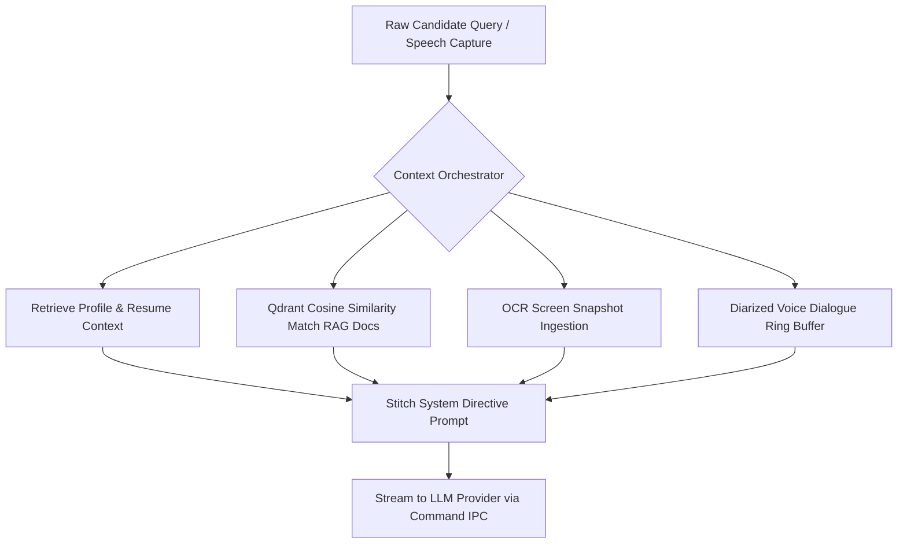

# BackDoor AI 🎯 — Technical Architecture & Developer Specifications

This document outlines the system architecture, folder layouts, database structures, and semantic data pipelines of **BackDoor AI** for developers and contributors.

---

## 🏛️ High-Level System Architecture

BackDoor AI is architected as a native, single-executable desktop application combining a React 18 frontend with a high-performance Rust core:

```
┌─────────────────────────────────────────────────────────────────────────────────────────────┐
│                                       FRONTEND LAYER                                        │
│  React 18 + TypeScript + Vite + Tailwind CSS + Lucide Icons + Zustand State Management       │
│  ┌─────────────────────────┐  ┌──────────────────────────┐  ┌────────────────────────────┐  │
│  │ Main Workspace Window   │  │ Stealth HUD Overlay View │  │ Mock Interview Studio Track│  │
│  │ (Chats, STAR, Settings) │  │ (Always-on-top, Glass)   │  │ (Radar Rubrics, Voice TTS) │  │
│  └─────────────────────────┘  └──────────────────────────┘  └────────────────────────────┘  │
└──────────────────────────────────────────────┬──────────────────────────────────────────────┘
                                               │  Tauri v2 IPC (Commands & Stream Events)
┌──────────────────────────────────────────────▼──────────────────────────────────────────────┐
│                                   RUST CORE ENGINE (BACKEND)                                │
│                                                                                             │
│  ┌─────────────────────────────────┐  ┌──────────────────────────────────────────────────┐  │
│  │ 🎙️ Audio Capture Subsystem       │  │ 🖥️ Screen Vision & OCR Engine                    │  │
│  │ - WASAPI Loopback (Interviewer) │  │ - WinRT OCR / Windows GDI Screen Capture          │  │
│  │ - WASAPI Mic (Candidate Audio)  │  │ - RAII GdiCaptureGuard & WinRT Exception Isolation│  │
│  │ - Sub-100ms Whisper STT Stream  │  │ - Multi-Monitor Virtual Screen Matrix             │  │
│  └─────────────────────────────────┘  └──────────────────────────────────────────────────┘  │
│                                                                                             │
│  ┌─────────────────────────────────┐  ┌──────────────────────────────────────────────────┐  │
│  │ 🧠 Context Orchestrator         │  │ 🤖 Multi-Provider Frontier LLM Router            │  │
│  │ - STAR Experience Injection     │  │ - Google Gemini (gemini-3.7-flash, 3.1-pro)       │  │
│  │ - RAG Vector Matches Assembly   │  │ - Groq LPU (gpt-oss-120b, llama-3.3-70b)         │  │
│  │ - System Prompt Hardening       │  │ - Anthropic (claude-sonnet-4.6, opus-4.6)        │  │
│  │ - Dialogue Ring Buffer Merging  │  │ - OpenAI (gpt-5.4, gpt-4o, whisper-1)            │  │
│  └─────────────────────────────────┘  └──────────────────────────────────────────────────┘  │
│                                                                                             │
│  ┌─────────────────────────────────┐  ┌──────────────────────────────────────────────────┐  │
│  │ 🗄️ SQLite 3 Relational Storage  │  │ ⚡ Qdrant Local Vector Engine (Sidecar)          │  │
│  │ - Messages & Conversations      │  │ - Dynamic Runtime Port Allocation                │  │
│  │ - STAR Stories & Mock Reports   │  │ - 384-Dim Normalized Embeddings (Cosine Distance)│  │
│  │ - User Profile & RAG Docs       │  │ - Fast In-Memory Vector Similarity Search        │  │
│  └─────────────────────────────────┘  └──────────────────────────────────────────────────┘  │
│                                                                                             │
│  ┌─────────────────────────────────┐  ┌──────────────────────────────────────────────────┐  │
│  │ 🔒 Windows DPAPI Keyring        │  │ 🛡️ Window Display Affinity Manager               │  │
│  │ - Zero-plaintext API key crypto │  │ - SetWindowDisplayAffinity(WDA_EXCLUDEFROMCAPT)  │  │
│  │ - Local credential isolation    │  │ - Screen-share proof invisibility (Zoom/Teams)   │  │
│  └─────────────────────────────────┘  └──────────────────────────────────────────────────┘  │
│                                                                                             │
│  ┌─────────────────────────────────┐  ┌──────────────────────────────────────────────────┐  │
│  │ 🪵 Process & Stream Logger       │  │ 📁 Persistent Overlay Session Sync               │  │
│  │ - stdout/stderr win_redirect mod │  │ - save_overlay_message command turn logging       │  │
│  │ - CREATE_NO_WINDOW sidecar spawn│  │ - sync_overlay_session_rag real-time indexing    │  │
│  │ - Dedicated App/Ollama/Qdrant logs│  │ - RAG transcript markdown compilation            │  │
│  └─────────────────────────────────┘  └──────────────────────────────────────────────────┘  │
└─────────────────────────────────────────────────────────────────────────────────────────────┘
```

---

## 📂 Project Folder & Directory Structure

```
BackDoor-AI/                            # Root Repository Directory
├── BackDoor AI Setup.exe               # 🚀 Installer package for Windows
├── AGENTS.md                          # Subagent architectural rules & technical invariants
├── README.md                          # User guide & runtime documentation
│
├── tools/
│   └── qdrant-x86_64-pc-windows-msvc.zip # Local Qdrant vector database sidecar package
│
├── backdoor-ai-ui/                     # ⚛️ React 18 + TypeScript Frontend Workspace
│   ├── package.json                   # UI dependencies & scripts
│   ├── tsconfig.json                  # TypeScript compilation rules
│   ├── vite.config.ts                 # Vite config
│   ├── tailwind.config.js             # Styling design tokens
│   ├── index.html                     # Application entry HTML
│   └── src/                           # React UI source code (App, components, services)
│       ├── App.tsx                    # Main workspace layout shell
│       ├── index.css                  # Global dark-mode glassmorphic styling
│       ├── components/                # HUD overlay, Interview studio, and settings views
│       ├── services/                  # Typed @tauri-apps/api/core IPC commands wrapper
│       └── types/                     # TypeScript types and interfaces
│
└── backdoor-ai-be/                     # 🦀 Native Rust Backend Core (Tauri Container)
    ├── Cargo.toml                     # Rust dependencies manifest
    ├── tauri.conf.json                # Tauri v2 configuration & window settings
    ├── build.rs                       # Tauri build script hook
    └── src/                           # Rust source files (audio, OCR, db, key management)
        ├── main.rs                    # Desktop app entry point
        ├── lib.rs                     # Tauri runtime bootstrapping, hotkeys, and command router
        ├── ai_provider.rs             # Multi-provider LLM endpoint router
        ├── audio_capture.rs           # WASAPI low-latency loopback and mic capture
        ├── commands.rs                # Tauri command IPC handler registry
        ├── context_orchestrator.rs     # Context stitching pipeline (RAG, STAR, OCR)
        ├── credential_store.rs        # DPAPI Windows Credential Manager integration
        ├── database.rs                # SQLite schema management & query runner
        ├── ocr_engine.rs              # Native Windows WinRT OCR integration
        ├── overlay_manager.rs         # Win32 screen-share window capturing exclusion
        ├── port_picker.rs             # Dynamic free port allocation
        ├── process_manager.rs         # Sidecar process manager for qdrant.exe
        ├── qdrant_client.rs           # RAG vectors and embedding pipeline
        ├── screen_capture.rs          # Multi-monitor screen capture coordination
        ├── stt_engine.rs              # Whisper Speech-to-Text transcriber
        └── text_utils.rs              # Text processing helper functions
```

---

## 🗄️ Database (DB) Design & Schema Blueprint

Relational data is managed exclusively by **SQLite 3 (`rusqlite`)** and stored at:  
`%LOCALAPPDATA%\com.backdoor.desktop\backdoor.db`

### Entity-Relationship Diagram

```
┌──────────────────┐          ┌──────────────────┐          ┌───────────────────────┐
│   user_profile   │          │  conversations   │          │ mock_interview_session│
├──────────────────┤          ├──────────────────┤          ├───────────────────────┤
│ id (PK)          │          │ id (PK)          │          │ id (PK)               │
│ category         │          │ title            │          │ title                 │
│ attribute_key    │          │ provider         │          │ target_role           │
│ attribute_value  │          │ model            │          │ track                 │
│ updated_at       │          │ updated_at       │          │ overall_score         │
└──────────────────┘          └────────┬─────────┘          │ radar_scores (json)   │
                                       │ 1:N                │ transcript_json       │
                               ┌────────▼─────────┐          └───────────────────────┘
                               │     messages     │
                               ├──────────────────┤          ┌───────────────────────┐
                               │ id (PK)          │          │     star_stories      │
                               │ conversation_id  │          ├───────────────────────┤
                               │ role             │          │ id (PK)               │
                               │ content          │          │ title                 │
                               │ token_count      │          │ leadership_principle  │
                               └──────────────────┘          │ situation, task       │
                                                             │ action, result        │
                                                             │ key_learnings         │
┌──────────────────┐          ┌──────────────────┐          └───────────────────────┘
│    documents     │ 1:N      │ document_chunks  │
├──────────────────┼─────────►├──────────────────┤
│ id (PK)          │          │ id (PK)          │
│ file_name        │          │ document_id (FK) │
│ file_type        │          │ chunk_index      │
│ file_hash (UQ)   │          │ content          │
│ chunk_count      │          │ qdrant_point_id  │
└──────────────────┘          └──────────────────┘
```

### Table Definitions & Purpose
1. **`user_profile`**: Stores candidate resume summaries, primary tech stacks, target job titles, and custom behavioral tone guidelines.
2. **`conversations` & `messages`**: Structured storage for technical chats, code queries, and problem-solving logs.
3. **`documents` & `document_chunks`**: Metadata and text chunks for ingested PDFs, DOCX, and architecture whitepapers.
4. **`star_stories`**: Structured matrix of behavioral stories (Situation, Task, Action, Result, Learnings) mapped to Amazon Leadership Principles, Google Googlyness, and engineering competencies.
5. **`mock_interview_sessions`**: Complete logs of AI mock interviews with radar rubric scores (Technical Depth, Communication, Structure, Trade-offs) and markdown feedback.

---

## 🧠 Qdrant Vector Storage & Local RAG Pipeline

BackDoor AI integrates an embedded local **Qdrant vector engine** for instant semantic retrieval without external vector cloud costs.

```
┌────────────────────────────┐      ┌───────────────────────────┐      ┌───────────────────────────┐
│  Candidate Ingests Document│ ───► │ Semantic Chunking Engine  │ ───► │ Vector Embedding Model    │
│  (.pdf, .docx, .md, .txt)  │      │ (500 chars, 50 overlap)   │      │ (384-dim Normalized Float)│
└────────────────────────────┘      └───────────────────────────┘      └─────────────┬─────────────┘
                                                                                     │
┌────────────────────────────┐      ┌───────────────────────────┐                    │
│ Grounded LLM System Prompt │ ◄─── │ Top-K Cosine Similarity   │ ◄──────────────────┘
│ (Injected before question) │      │ Search in Qdrant Sidecar  │
└────────────────────────────┘      └───────────────────────────┘
```

### Technical RAG Mechanics
1. **Dynamic Sidecar Supervisor**: On application startup, `port_picker.rs` allocates an available dynamic port (e.g. `6333`+), and `process_manager.rs` launches `tools\qdrant.exe`.
2. **Collection Initialization**: `qdrant_client.rs` ensures collection `backdoor_knowledge` exists configured with **Cosine distance** and **384-dimensional vectors**.
3. **Dual Embedding Mode**:
   - *With OpenAI Key*: Uses `text-embedding-3-small` (dimension 384) for state-of-the-art semantic precision.
   - *Offline / Zero-Key Fallback*: Uses high-entropy local 384-dimensional semantic bigram hash embeddings with L2 normalization.
4. **Context Injection**: During live assistance (`ask_overlay_assist`), the top matching document chunks and STAR stories are automatically combined by `context_orchestrator.rs` into the LLM system prompt.

---

## 🔄 End-to-End Data & Context Synthesis Flow



---

## 📈 Analytics & Download Tracking (For Maintainers)

To monitor user downloads and traffic sources for marketing optimizations:

* **GitHub Release Downloads**: Total downloads of the release binary `BackDoor AI Setup.exe` are tracked natively by GitHub. You can view the live count and stats using the [GitHub Release Stats Dashboard](https://tooomm.github.io/github-release-stats/?username=marotiuppe&repository=BackDoor-AI).
* **Landing Page Traffic**: You can embed a privacy-first, cookie-free web analytics snippet (like Cloudflare Web Analytics or Umami) inside the `<head>` of your `index.html` to measure daily visitors and click-events on the **Download** button.
* **Social Media Campaigns**: Create campaign redirect links using **Bitly** or **Dub.co** (e.g. `bit.ly/backdoor-reddit` or `bit.ly/backdoor-tiktok`) to track which platform drives the most landing page traffic and downloads.
